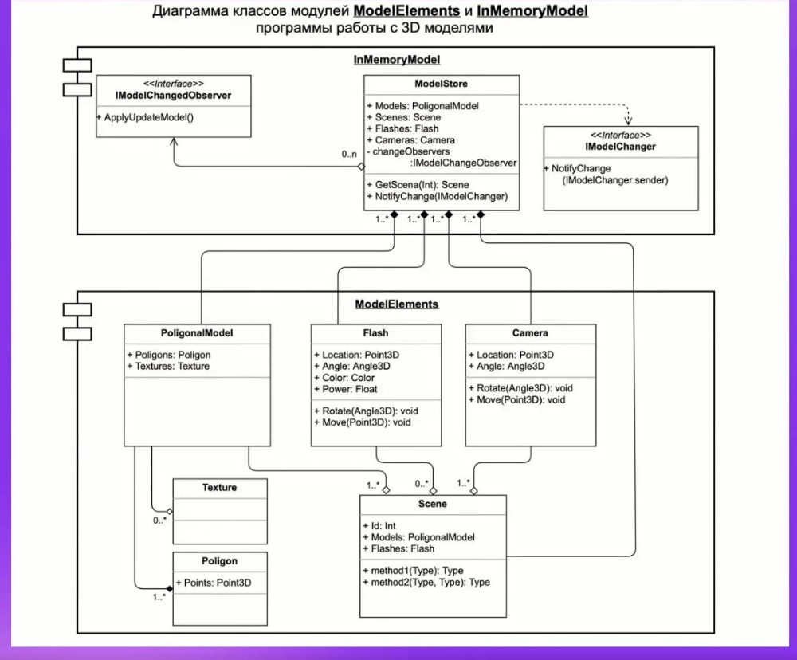

# Диаграмы классов ModelElements.
## I. Техзадание:
- На основе Диаграмы классов ModelElements, разработать классы: Model Store, PoligonalModel (Texture, Poligon), Flash, Camera, Scene (Реализовать диограмму на любом языке программирования).
- 
